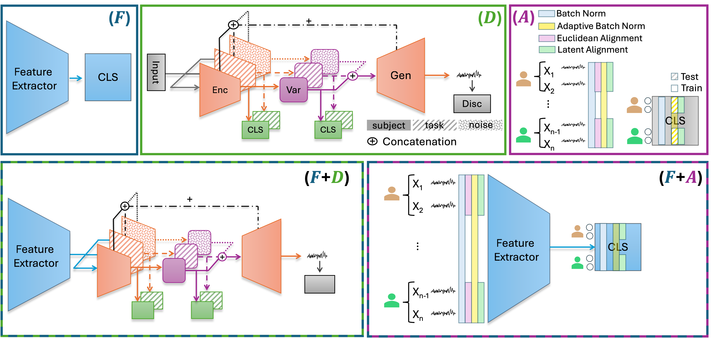

# Investigating Foundation Models, Disentanglement and Latent Alignment for Subject-Independent EEG Learning
 
> A modular framework for controlled, reproducible evaluation of Brain Foundation Models, Disentangled VAEs, and Latent Alignment strategies for cross-subject EEG generalization.
 
---
 
## Prerequisites
 
This project uses [`uv`](https://github.com/astral-sh/uv) for fast Python package management. Install it before anything else:
 
```bash
curl -LsSf https://astral.sh/uv/install.sh | sh
```
 
Then install project dependencies:
 
```bash
uv sync
```
 
---
 
## Overview
 
EEG-based Brain–Computer Interfaces (BCIs) suffer from strong inter-subject variability — skull thickness, electrode placement, and baseline neural activity all vary across individuals, causing models to overfit to subject-specific patterns and fail to generalize to unseen subjects.
 
This repository provides a **unified, modular framework** to investigate three paradigms for subject-independent EEG learning:
 
| Module | Paradigm | Description |
|--------|----------|-------------|
| **F** | Brain Foundation Models | Large-scale EEG pretraining (CBraMod, LaBraM, EEGPT) |
| **D** | Disentangled VAE | Explicitly separates *subject*, *task*, and *noise* factors |
| **A** | Latent Alignment | Reduces distribution shifts across subjects (BN, AdaBN, EA, LA) |
 
The three modules can be combined or activated independently, enabling systematic ablation studies.
 
---
 
## Framework Architecture
 


 
## Running Experiments
 
All experiments are launched via dataset-specific shell scripts. Each script runs the full ablation suite for that dataset.
 
### Motor Imagery (MI)
 
```bash
bash ./eeg_disentanglement/scripts/yaml_scripts/MI/MI_execute.sh
```
 
### ERP CORE
 
```bash
bash ./eeg_disentanglement/scripts/yaml_scripts/ERP/ERP_execute.sh
```
 
> Scripts expect `uv` to be available in `$PATH`. Each script reads from the corresponding YAML config files in the same directory.
 
---
 
## Datasets
 
| Dataset | Subjects | Channels | Hz | Task | Classes |
|---------|----------|----------|----|------|---------|
| [EEG Motor Movement/Imagery](https://physionet.org/content/eegmmidb/1.0.0/) | 109 | 64 | 160 Hz → 200 Hz | Motor imagery (left fist, right fist, both fists, both feet) | 4 |
| [ERP CORE](https://erpinfo.org/erp-core) | 40 | 30 | 1024 Hz → 200 Hz | 7 ERP components (N170, MMN, N2pc, N400, P3b, LRP, ERN) | 14 |
 
All data are resampled to **200 Hz** to meet Brain Foundation Model requirements.
 
---
 
## Results
 
Evaluation uses a fully **subject-independent** protocol: test subjects are entirely excluded from training and validation. Metrics: Balanced Accuracy (BAcc), Precision (P), Recall (R), F1. Chance level: **25%** for MI, **7.1%** for ERP.
 
### Block F — Backbone Comparison
 
Fine-tuning each BFM end-to-end with D and A disabled.
 
| Model | MI BAcc | MI P | MI R | MI F1 | ERP BAcc | ERP P | ERP R | ERP F1 |
|-------|--------:|-----:|-----:|------:|---------:|------:|------:|-------:|
| **F₁ CBraMod** | **55.8** | **59.9** | **55.8** | **56.2** | **55.0** | **62.0** | 57.7 | 58.7 |
| F₂ LaBraM | 54.9 | 55.9 | 54.9 | 54.8 | 51.5 | **62.0** | **62.5** | **61.8** |
| F₃ EEGPT | 43.8 | 44.7 | 43.8 | 44.0 | 48.3 | 60.8 | 58.7 | 59.0 |
 
> CBraMod achieves the highest balanced accuracy on both datasets and is used as the backbone for subsequent experiments.
 
---
 
### Block D — Disentanglement Ablation
 
Progressive ablation of VAE components, using CBraMod as backbone. Cross-contamination metrics assess disentanglement quality: ↓ arrows indicate metrics that should be *low* for good disentanglement.
 
**Configurations:**
 
| Config | Description |
|--------|-------------|
| **D₁** | VAE + KL + classification (no reconstruction) |
| **D₂** | D₁ + STFT multi-resolution reconstruction loss (no skip connections) |
| **D₃** | D₂ + skip connections between encoder and decoder |
| **D₄** | D₂ + cross-latent losses (intra, cross, cycle) + WGAN-GP adversarial (no skip connections) |
| **D₅** | D₄ + skip connections between encoder and decoder |
 
**Motor Imagery (MI):**
 
| Config | BAcc | Var BAcc | z_t→t | z_t→s ↓ | z_s→t ↓ | z_s→s | STFT ↓ |
|--------|-----:|---------:|------:|--------:|--------:|------:|-------:|
| D₁ | 26.9 | 27.1 | 26.3 | 32.2 | 51.0 | 90.1 | — |
| D₂ | 42.4 | 42.6 | 46.3 | 32.7 | 35.7 | 84.7 | 1.991 |
| D₃ | **52.7** | **53.0** | **52.7** | 36.2 | 19.5 | 87.7 | 2.064 |
| D₄ | 48.4 | 48.4 | 50.7 | 30.1 | 24.9 | **91.6** | 1.866 |
| D₅ | 51.2 | 50.6 | **52.7** | **23.6** | **17.2** | 73.2 | **1.858** |
 
**ERP CORE:**
 
| Config | BAcc | Var BAcc | z_t→t | z_t→s ↓ | z_s→t ↓ | z_s→s | STFT ↓ |
|--------|-----:|---------:|------:|--------:|--------:|------:|-------:|
| D₁ | 30.1 | 12.7 | 25.9 | **3.8** | **26.8** | 3.1 | — |
| D₂ | 40.3 | 40.4 | 61.0 | 70.5 | 57.3 | **95.3** | 1.255 |
| D₃ | **44.7** | **44.6** | 60.1 | 60.1 | 52.8 | 92.9 | 1.400 |
| D₄ | 43.2 | 43.0 | 60.1 | 53.3 | 55.5 | 92.0 | 1.246 |
| D₅ | 43.5 | 43.4 | **62.2** | 77.1 | **48.9** | 91.3 | **1.230** |
 
**Key finding:** Adding the STFT reconstruction loss (D₁→D₃, which introduces skip connections on top of reconstruction) is the single most impactful step, nearly doubling task accuracy on MI (26.9%→52.7%) and substantially improving ERP (30.1%→44.7%). The generative objective is a structural necessity, not an auxiliary component.
 
### t-SNE Latent Space Visualizations
 

 
> Each row corresponds to a D configuration. Columns show z_s and z_t colored by subject and task labels respectively, revealing cross-factor leakage and disentanglement quality.
 
---
 
### Loss Components per Configuration
 
| Config | L_cls | L_KL | L_Recon | L_cycle | L_intra | L_cross | L_cc-cycle | L_KD | L_adv |
|--------|:-----:|:----:|:-------:|:-------:|:-------:|:-------:|:----------:|:----:|:-----:|
| D₁ | ✓ | ✓ | — | — | — | — | — | — | — |
| D₂ | ✓ | ✓ | ✓ | — | — | — | — | — | — |
| D₃ | ✓ | ✓ | ✓ | — | — | — | — | — | — |
| D₄ | ✓ | ✓ | ✓ | ✓ | ✓ | ✓ | ✓ | ✓ | ✓ |
| D₅ | ✓ | ✓ | ✓ | ✓ | ✓ | ✓ | ✓ | ✓ | ✓ |
 
---
 
## Alignment Strategies (Block A)
 
Four alignment methods applied at different stages:
 
| Method | Stage | Description |
|--------|-------|-------------|
| **BN** | Training | Standard batch normalization |
| **AdaBN** | Inference | Updates BN statistics per subject at test time |
| **EA** | Input | Whitens per-subject covariance before the network |
| **LA** | Latent | Standardizes features per subject inside the network |
 
---

| Method | MI BAcc | MI P | MI R | MI F1 | ERP BAcc | ERP P | ERP R | ERP F1 |
|--------|--------:|-----:|-----:|------:|---------:|------:|------:|-------:|
| F₁ CBraMod (baseline) | 55.8 | 59.9 | 55.8 | 56.2 | 55.0 | 62.0 | 57.7 | 58.7 |
| A₁ BN    | 54.5 | 55.3 | 54.5 | 54.7 | 55.0 | 62.9 | 58.8 | 59.8 |
| A₂ AdaBN | 58.7 | 59.1 | 58.7 | 58.8 | 54.9 | 62.4 | 54.3 | 55.0 |
| A₃ EA    | 25.0 |  6.2 | 24.9 | 10.0 | 33.7 | 43.6 | 35.3 | 33.8 |
| **A₄ LA** | **60.1** | **60.1** | **60.1** | **60.0** | **57.2** | **64.5** | **63.0** | **63.5** |
 
> Latent Alignment (LA) is the single most effective intervention, consistently outperforming the baseline on both datasets (+4.3 BAcc on MI, +2.2 on ERP). Euclidean Alignment collapses performance on both datasets, as input-space covariance whitening is incompatible with the spectral representations of pretrained backbones.

---
 
## Conclusion
 
Three findings stand out from the experiments:
 
**Foundation models provide a strong but interchangeable baseline.** 
 
**Latent Alignment is the most practical intervention.** 
 
**Reconstruction is the prerequisite for disentanglement.** 


---
 